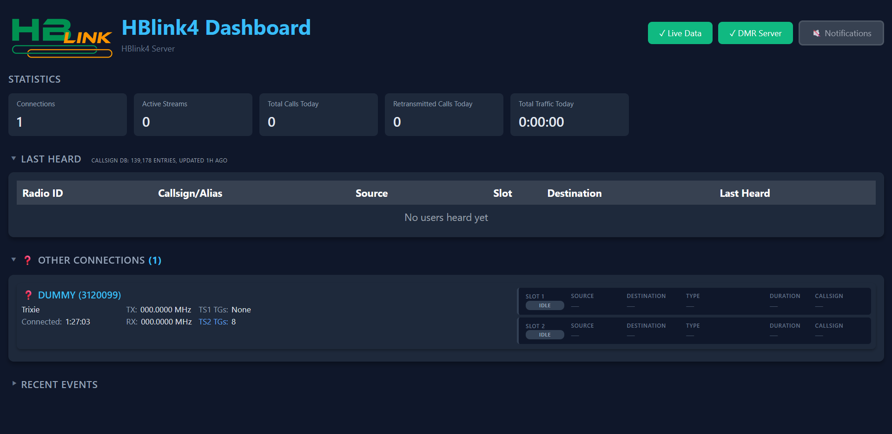

# HBlink4 Docker Installer

Debian 11 / 12 / 13 and Ubuntu 22.04 / 24.04 LTS.


This is a **destructive** one-shot installer for [HBlink4](https://github.com/n0mjs710/HBlink4) (Cortney T. Buffington, N0MJS) as two Docker Compose v2 services on `network_mode: host`. Recommended on a freshly installed machine.

HBlink4 is **not** on Docker Hub. This installer clones N0MJS's git tree to `/opt/HBlink4` and **builds local images** (`hblink4-engine:local` and `hblink4-dash:local`) from `python:3.14-slim-bookworm`.

**This repository is the installer only.** HBlink4 and its companion programs remain copyright Cortney T. Buffington, N0MJS. The installer is copyright Shane Daley, M0VUB aka ShaYmez and accepts **no responsibility or liability** for installing, running, or using this software — including damage, data loss, downtime, or anything else that follows. You use it at your own risk.

## Stack

- **hblink4** — DMR engine, UDP **62031** (host network)
- **hblink4-dash** — official FastAPI dashboard, TCP **8080**
- Event link: TCP **127.0.0.1:8765** (dashboard listens, engine dials). Official samples use a Unix socket; the installer patches both JSON files so split containers work.

The dashboard is a **separate Compose service** so it can be swapped later (for HBMonv4 monitor development...) without touching the engine. (Are you up
for the task?) There's nothing wrong with the built in dash... but people prod!



## Prerequisite

Root on Debian 11/12/13 or Ubuntu 22.04/24.04. Git installed. Docker Compose **v2** (`docker compose` with a space!!) is installed by this script from Docker’s official repo.

```sh
apt-get install -y git
apt update
sudo su
```

## Installation

```sh
git clone https://github.com/ShaYmez/hblink4-docker-install
cd hblink4-docker-install
./hblink4-docker-install.sh
```

Clone wherever you like; `/opt` is a good home. Follow the prompts. Change `passphrase` in `/etc/hblink4/config/config.json` from `CHANGE-ME` before putting a live repeater on the server.

Control menu:

```sh
hblink4-menu
```

Standalone commands:

```sh
hblink4-start
hblink4-stop
hblink4-restart
hblink4-flush
hblink4-logs          # docker compose logs -f --tail=50
hblink4-diagnostics
hblink4-ssl           # Let's Encrypt HTTPS on 443 (optional)
hblink4-update
hblink4-upgrade
hblink4-uninstall
```

## Configuration

If `config.json` is missing, the installer downloads Cortney’s raw `config_sample.json` (and the dashboard sample) from GitHub so the containers can start. Existing operator files are **never** overwritten.

| Host path | Role |
|-----------|------|
| `/etc/hblink4/config/config.json` | Engine |
| `/etc/hblink4/dashboard/config.json` | Dashboard |
| `/etc/hblink4/dashboard/data/` | RadioID cache / last-heard |
| `/var/log/hblink4/` | Engine file logs |
| `/opt/HBlink4` | Cortney’s git checkout (build context) |
| `/etc/hblink4/docker-compose.yml` | Compose v2, no `version:` key |
| `/etc/hblink4/apache/hblink4-dash.conf` | Apache vhost template (used by `hblink4-ssl`) |

```sh
cd /etc/hblink4
docker compose up -d
docker compose down
docker compose logs -f --tail=50
nano config/config.json
```

## Update and upgrade

Both pull **this** installer repo and **n0mjs710/HBlink4**, then rebuild local images. Configs are not touched.

```sh
hblink4-update      # git pull + docker compose build + up
hblink4-upgrade     # same, with --no-cache --pull of the Python base image
```

There is no `docker compose pull` of an HBlink4 app image — it does not exist on Docker Hub (PR maybe?).

## HTTPS (optional)

The dashboard stays on uvicorn **8080**. HTTPS is Apache on the host — same idea as `hblink-ssl` on the HBlink3 installer. Not installed by default.

From **Configuration** → **Enable HTTPS**, or:

```sh
hblink4-ssl hblink.freestar.network shane@freestar.network
```

That issues a Let's Encrypt cert, redirects HTTP to HTTPS on **443**, proxies `/` and `/ws` to `127.0.0.1:8080`, then binds the dashboard to localhost so `:8080` is no longer public. DNS for the FQDN must already point at this host, and **TCP 80** must be reachable (HTTP-01).

Preview without changing the box:

```sh
hblink4-ssl --dry-run hblink.freestar.network shane@freestar.network
```

## Ports

```
http       80/tcp   (after hblink4-ssl: ACME + redirect)
https      443/tcp  (after hblink4-ssl)
dashboard  8080/tcp (localhost only after HTTPS)
events     8765/tcp   (localhost only)
MMDVM      62031/udp
IPv6 DMR   62032/udp  (off by default)
OBP        per openbridge_connections local_port in config.json
ssh        22/tcp
```

## Companion programs (not installed)

These are **separate daemons** by N0MJS. They are not plugins inside HBlink4 and this installer does not build or start them. With host networking they can reach `127.0.0.1:62031` from the same machine.

| Program | Repo | How it talks to HBlink4 |
|---------|------|-------------------------|
| dmr-talkback | https://github.com/n0mjs710/dmr-talkback | Logs in as an HBP repeater (voice test / echo). Needs an access-control entry; subscribes with `Options=`. |
| ipsc2hbpc | https://github.com/n0mjs710/ipsc2hbpc | Motorola IPSC ⇄ HBP (C, preferred). Looks like a repeater to HBlink4. |
| ipsc2hbp | https://github.com/n0mjs710/ipsc2hbp | Same translator in Python 3.11+. Prefer ipsc2hbpc for production. |
| cc2obp | https://github.com/n0mjs710/cc2obp | c-Bridge CC-CC ⇄ OpenBridge. Peer it to `openbridge_connections` in `config.json`. |

OpenBridge trunks themselves are **built into** HBlink4 (`openbridge_connections` in the engine JSON). Typical use is an HBlink3 core to this HBlink4 edge — no extra binary.

## Uninstall

```sh
hblink4-uninstall
```

Backs up `/etc/hblink4` under `/root/hblink4-backup-<timestamp>`. Docker, Apache, certbot, and Let's Encrypt certificates stay installed.

## License and credits

- **HBlink4** and companions: Copyright (C) 2016-2026 Cortney T. Buffington, N0MJS `<n0mjs@me.com>` — GNU GPLv3
- **This installer** (scripts, Compose, Dockerfiles, menu): Copyright (C) 2026 Shane Daley, M0VUB aka ShaYmez `<shane@freestar.network>` — GNU GPLv3

This project installs and containers HBlink4. Give it a try!! Provided as-is, with **no warranty** and **no liability** for the install or what you run afterwards.

More: https://freestar.network/development and https://github.com/ShaYmez/
